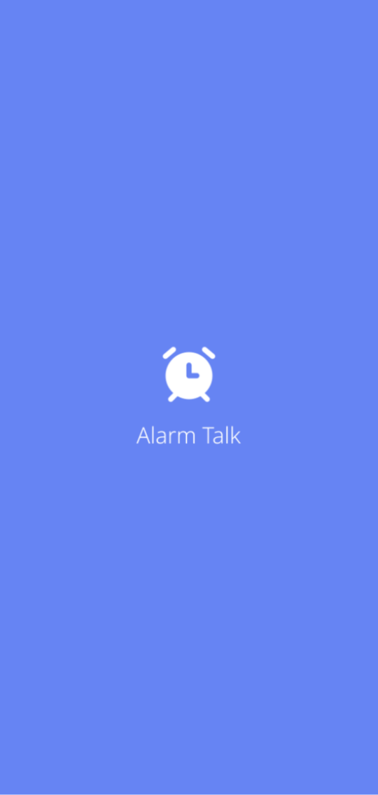
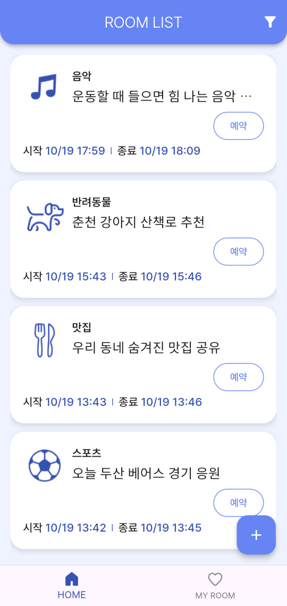
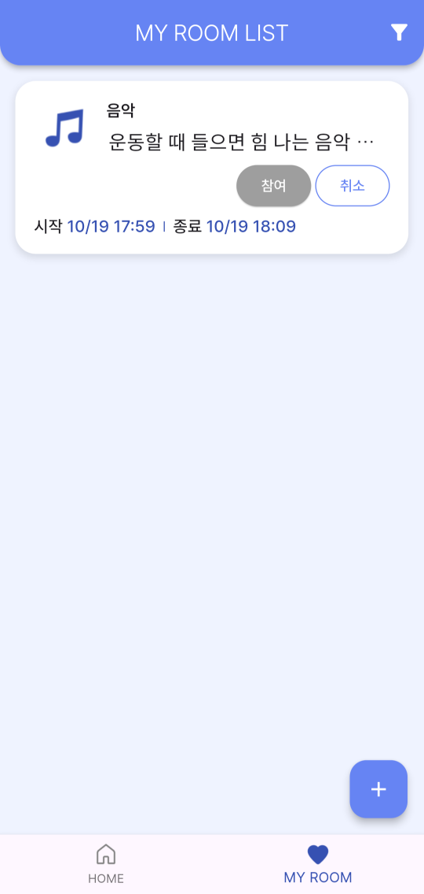
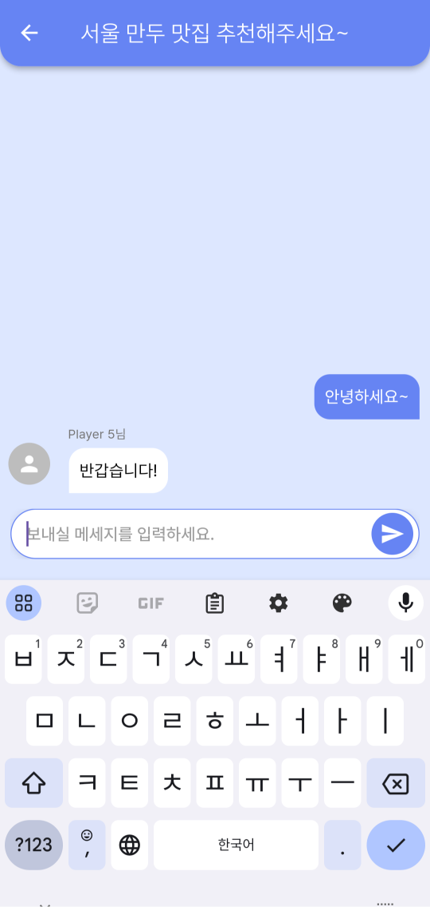
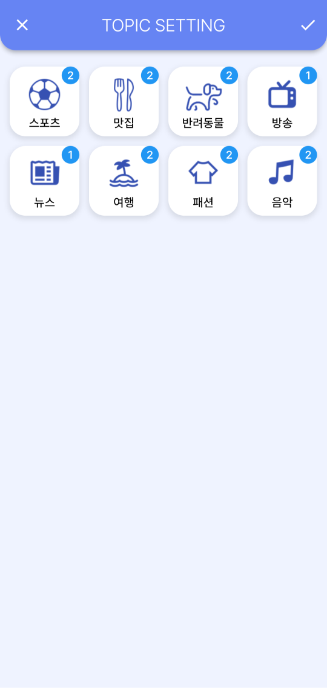
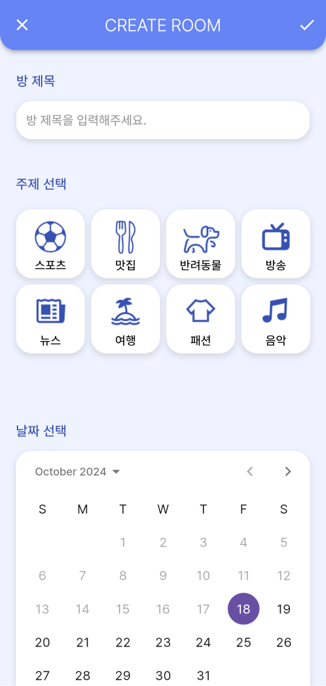

<div align=center style="display: flex; justify-content: center; align-items: center;flex-direction: column;">
    <div>
      
      
      
      
      
      
    </div>
    <div align="center">
        
        
    </div>
</div>


## 📃 목차 
- [📃 목차](#-목차)
- [💁 프로젝트 소개](#-프로젝트-소개)
- [📱 스크린샷](#-스크린샷)
- [⚙️ 사용한 기술 스택](#️-사용한-기술-스택)
- [🏗️ 디렉토리 구조](#️-디렉토리-구조)
- [🚩 성과](#-성과)
- [😎 팀원](#-팀원)

<br>

## 💁 프로젝트 소개
**"주제별로 특정 시간만 활성화되는 채팅방 기능을 가진 SNS 앱"**
- 원하는 채팅방을 예약하고, 예약한 방이 오픈되기 1분 전에 알림 전송
- 정해진 시간이 지나면 채팅방은 종료

<br>

## 📱 스크린샷
<div align="center">
  
  &nbsp;&nbsp;&nbsp;
  
  &nbsp;&nbsp;&nbsp;
  
</div>
<div align="center">
  
  &nbsp;&nbsp;&nbsp;
  
  &nbsp;&nbsp;&nbsp;
  
</div>

<br>

## ⚙️ 사용한 기술 스택
- ### Front
    
    
    &nbsp;&nbsp;&nbsp;
    
  
  | Package              | Purpose                             |
  | -------------------- | ----------------------------------- |
  | `http`               | REST API 통신을 위해 사용               |
  | `socket_io_client`   | 채팅 구현을 위해 사용 - SocketManager    |
  | `go_router`          | Screen navigation을 위해 사용          |
  | `permission_handler` | 알림 권한 요청을 위해 사용                |
- ### Back
    
    &nbsp;&nbsp;&nbsp;
     
    &nbsp;&nbsp;&nbsp;
    
    &nbsp;&nbsp;&nbsp;
  <br>
- ### 협업도구
    
    &nbsp;&nbsp;&nbsp;
    
    &nbsp;&nbsp;&nbsp;
    
    &nbsp;&nbsp;&nbsp;
    
    &nbsp;&nbsp;&nbsp;
    

<br>

## 🏗️ 디렉토리 구조
```
├── lib
│   ├── core
│   │   ├── app_color.dart
│   │   ├── app_constant.dart
│   │   └── app_font_size.dart
│   ├── main.dart
│   ├── manager
│   │   ├── notification_manager.dart
│   │   ├── socket_manager.dart
│   │   ├── toast_manager.dart
│   │   └── topic_manager.dart
│   ├── model
│   │   ├── player.dart
│   │   ├── room.dart
│   │   └── topic
│   │     ├── topic_count.dart
│   │     ├── topic_item.dart
│   │     └── topic.dart
│   ├── router.dart
│   ├── screens
│   │   ├── chat_screen.dart
│   │   ├── create_room_screen.dart
│   │   ├── favorite_screen.dart
│   │   ├── filter_screen.dart
│   │   ├── home_page.dart
│   │   ├── home_screen.dart
│   │   ├── styles
│   │   └── widgets
│   ├── services
│   │   ├── api_service.dart
│   │   └── end_point.dart
│   └── utils
│       ├── mixin
│       └── topic_mapped.dart
```

<br>

## 🚩 성과
1. 리팩토링을 통해 코드 가독성의 중요성을 알게되었습니다.
  * 방 목록을 가지고오는 코드에서 조건문이 많이 코드가 중복되고, 가독성이 떨어졌습니다.
    * 문제의 코드
        ```dart
        Future<void> _fetchRoomList({bool? isReload}) async {
          final DateTime now = DateTime.now();
          if (isReload != null && isReload) {
            _roomList = await _apiService.getRoomList(null, 10);
            _roomList = _roomList
                .where((room) => !room.isReserved && now.isBefore(room.startTime))
                .toList();
            if (_roomList.isNotEmpty) {
              cursorId = _roomList.last.roomId.toString();
            }
            if (mounted) setState(() {});
          } else {
            final toBeAddedRooms = await _apiService.getRoomList(cursorId, 10);
            if (toBeAddedRooms.isEmpty) {
              return;
            } else {
              _roomList += toBeAddedRooms;
              _roomList = _roomList
                  .where((room) => !room.isReserved && now.isBefore(room.startTime))
                  .toList();
              if (_roomList.isNotEmpty) {
                cursorId = _roomList.last.roomId.toString();
              }
            }
          }
        }
        ```
    * 개선 
        ```dart
        Future<void> _fetchRoomList({bool isReload = false}) async {
          final DateTime now = DateTime.now();
          List<Room> fetchedRooms =
              await _apiService.getRoomList(isReload ? null : cursorId, 10);
        
          if (fetchedRooms.isEmpty) return;
        
          final List<Room> filteredRoom = fetchedRooms
              .where((room) => !room.isReserved && now.isBefore(room.startTime))
              .toList();
        
          _roomList = isReload ? filteredRoom : _roomList += filteredRoom;
          cursorId = _roomList.isNotEmpty ? _roomList.last.roomId.toString() : null;
          if (mounted && isReload) setState(() {});
        }
        ```
      - isReload의 경우, 입력 받지 않을 경우에 초기값을 false로 구현해 옵셔널 확인 및 값을 확인하는 작업을 제거했습니다.
      - 필터 처리된 리스트를 추가하거나 대체하는 작업을 제외하면 나머지 코드는 동일하기에 데이터를 가져와 필터 처리를 먼저 진행하도록 수정했습니다. 즉, 두 번의 필터처리가 아닌 한 번만 수행하게 됩니다.
      - 이후, reload인지 more인지 확인 및 분기 처리하여 리스트를 업데이트했습니다.
2. http를 활용해 REST API를 구축하는 방법을 알 수 있었습니다.
  * EndPoint Enum
    ```dart
    enum EndPoint {
      topicList,
      topicRoomCount,
      player,
      roomList,
      roomCreate,
      roomIdList,
      deleteRoom,
    }

    extension EndPointExtension on EndPoint {
      String get url {
        switch (this) {
          case EndPoint.topicList:
            return '/topic/list';
          case EndPoint.topicRoomCount:
            return '/topic/room-count';
          case EndPoint.player:
            return '/player';
          case EndPoint.roomList:
            return '/room/list';
          case EndPoint.roomCreate:
            return '/room/create';
          case EndPoint.roomIdList:
            return '/room/ids';
          case EndPoint.deleteRoom:
            return '/room/delete';
          default:
            return '/';
        }
      }
    }
    ```
      * enum과 extension을 활용해 endpoint를 정의해 사용했습니다.
  * Get, Post, Delete Http Method를 사용해 필요한 데이터를 요청하거나, 보내는 방법을 알 수 있었습니다.
    * [apiService.dart](https://github.com/9oHigh/usket.Discussion-App/blob/main/lib/services/api_service.dart)
    * 예시 코드
      ```dart
      Future<List<TopicCount>> getTopicRoomCounts() async {
        // EndPoint extension을 활용해 url을 가져와 get method를 통해 요청
        final response =
            await http.get(Uri.parse("$_baseUrl${EndPoint.topicRoomCount.url}"));
        // 결과 값을 확인하고 매핑해 반환
        if (200 <= response.statusCode && response.statusCode <= 299) {
          final List<dynamic> data = json.decode(response.body);
          final List<TopicCount> topicCounts =
              data.map((json) => TopicCount.fromJson(json)).toList();
          return topicCounts;
        } else {
          throw Exception('Failed to load topic room counts');
        }
      }
      ```

## 😎 팀원
  <table>
    <tr>
      <td>
      <a href="https://www.flaticon.com/kr/free-icons/" title="소녀 아이콘 제작자: Freepik - Flaticon">
      
      </td>
      <td width="300px">
        <a href="https://github.com/flow2c">
          신가연
        </a>
        <br />
        - 채팅방 생성 화면과 기능<br>
        - 필터 화면 및 기능<br>
        - 채팅방 알림 예약, 취소<br>
        - UI 디자인 및 구현
      </td>
      </a>
    </tr>
  </table>
  <table>
    <tr>
      <td>
      <a href="https://www.flaticon.com/kr/free-icons/" title="남자 아이콘 제작자: Freepik - Flaticon" target="_blank">
        
      </a>
      </td>
      <td width="300px">
        <a href="https://github.com/9oHigh">
          이경후
        </a>
        <br />
        - 홈 화면과 기능<br>
        - 채팅 화면과 기능<br>
        - 라우터 적용<br>
        - 리팩토링(비지니스 로직과 예외처리)
      </td>
    </tr>
  </table>